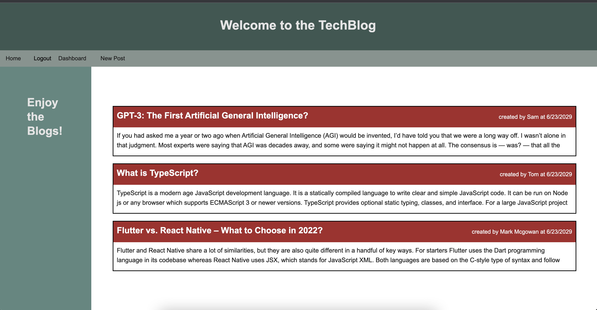

<div id="top"></div>
<div align="center">

[![Issues][issues-shield]][issues-url]
[![MIT License][license-shield]][license-url]
[![linkedin][linkedin-shield]][linkedin-url]

</div>
 <br />
 <br />

<div align="center">

</div>

<h1 align="center">Tech Blog</h1>

  <p align="center">
    This Tech Blog is a project demonstrates a fully functioning blog website. The tech blog has been developed so that users can add blogs, update blogs and create comments to their blogs. Tech Blog app has an authentication process whereby a user can create a profile using valid sign-in credentials. 
    <br />
    <a href="https://github.com/TomSouthwick/Tech-Blog"><strong>Explore the docs »</strong></a>
    <br />
    <br />
    ·
    <a href="https://youtu.be/p7mxk2NVYT0">View Demo</a>
    ·
    <a href="https://github.com/TomSouthwick/Tech-Blog/issues">Report Bug</a>
    ·
    <a href="https://github.com/TomSouthwick/Tech-Blog/issues">Request Feature</a>
  </p>
</div>

 <br />
 <br />
<!-- TABLE OF CONTENTS -->
<h3/>
<b/>
<details>
  <summary>Table of Contents</summary>
  <ol>
    <li>
      <a href="#about-the-project">About The Project</a>
      <ul>
        <li><a href="#built-with">Built With</a></li>
      </ul>
    </li>
    <li>
      <a href="#getting-started">Getting Started</a>
      <ul>
        <li><a href="#prerequisites">Prerequisites</a></li>
        <li><a href="#installation">Installation</a></li>
      </ul>
    </li>
    <li><a href="#usage">Usage</a></li>
    <li><a href="#roadmap">Roadmap</a></li>
    <li><a href="#license">License</a></li>
    <li><a href="#contact">Contact</a></li>
    <li><a href="#acknowledgments">Acknowledgments</a></li>
  </ol>
</details>
</h3>
</b>
 <br />
 <br />

<!-- ABOUT THE PROJECT -->

## About The Project

 <br />


 <br />

This project is designed to demonstrate the back-end capabilities of a fully functioning blog-website. The project allows a user to create an account and log in. Then it allows them to blog about all things tech! They can comment on the blg to start discussions and even edit their blogs after they have published them. The tech blog encrypts user's passwords so that it is unattainable for those who try and write blogs on other people's behalf.

<p align="right">(<a href="#top">back to top</a>)</p>

### Built With

- [Sequelize](https://sequelize.org/)
- [Javascript](https://www.javascript.com/)
- [Express Node.js](https://expressjs.com/)
- [Handlebars](https://handlebarsjs.com/)

<p align="right">(<a href="#top">back to top</a>)</p>

<!-- GETTING STARTED -->

## Getting Started

Clone the repo into a local folder. Open that folder in VS Code.

### Prerequisites

Ensure that VS Code has the required languages with the respective functionalities built in.

### Installation

1. Clone the repo
   ```sh
   git clone https://github.com/TomSouthwick/Tech-Blog.git
   ```
2. Install NPM packages
   ```sh
   npm install
   ```
3. Seed the database
    ```sh
    npm run seed
    ```
4. Run the server
   ```sh
   node index.js
   ```

<p align="right">(<a href="#top">back to top</a>)</p>

<!-- USAGE EXAMPLES -->

## Usage

A user will initially be asked to create an account with a valid email address. Once the account has been created, said user will be able to will the seeded data blogs. The user will also be able to create their own blogs and comment on previous blogs written. If a user wishes they will be able to navigate to other users blogs and comment on their blogs. A user will not be able to write on behalf of other users blogs. 

_For more examples, please refer to the [Documentation](https://github.com/TomSouthwick/Tech-Blog)_

<p align="right">(<a href="#top">back to top</a>)</p>

<!-- ROADMAP -->

## Roadmap

- ✅ Created databases with defined types
- ✅ Created routes to serve the information from the database
- ✅ Linking users blogs and comments.
  - ✅ Including routes for adding blogs and editing blogs
- ✅ Creating the appropriate server and middleware.
  - ✅ displaying dynamic backend content through .handlebars.
- ✅ Ensuring the log in and authentication is working and hidden

See the [open issues](https://github.com/TomSouthwick/Tech-Blog/issues) for a full list of proposed features (and known issues).

<p align="right">(<a href="#top">back to top</a>)</p>

<!-- CONTRIBUTING -->

<!-- LICENSE -->

## License

Distributed under the MIT License. See `LICENSE.txt` for more information.

<p align="right">(<a href="#top">back to top</a>)</p>

<!-- CONTACT -->

## Contact

Tom Southwick - [Linkedin](https://linkedin.com/in/tomsouthwick)

Project Link: [https://github.com/TomSouthwick/Tech-Blog](https://github.com/TomSouthwick/Tech-Blog)

<p align="right">(<a href="#top">back to top</a>)</p>

<!-- ACKNOWLEDGMENTS -->

## Acknowledgments

- [ReadMe](https://github.com/othneildrew/Best-README-Template.git)

<p align="right">(<a href="#top">back to top</a>)</p>

<!-- MARKDOWN LINKS & IMAGES -->
<!-- https://www.markdownguide.org/basic-syntax/#reference-style-links -->

[issues-shield]: https://img.shields.io/github/issues/TomSouthwick/Tech-Blog.svg?style=for-the-badge
[issues-url]: https://github.com/TomSouthwick/Tech-Blog/issues
[license-shield]: https://img.shields.io/github/issues/TomSouthwick/Tech-Blog.svg?style=for-the-badge
[license-url]: https://github.com/TomSouthwick/Tech-Blog/blob/master/LICENSE.txt
[linkedin-shield]: https://img.shields.io/badge/-LinkedIn-black.svg?style=for-the-badge&logo=linkedin&colorB=555
[linkedin-url]: https://linkedin.com/in/tomsouthwick
[product-screenshot]: Assets/screenshot.png
